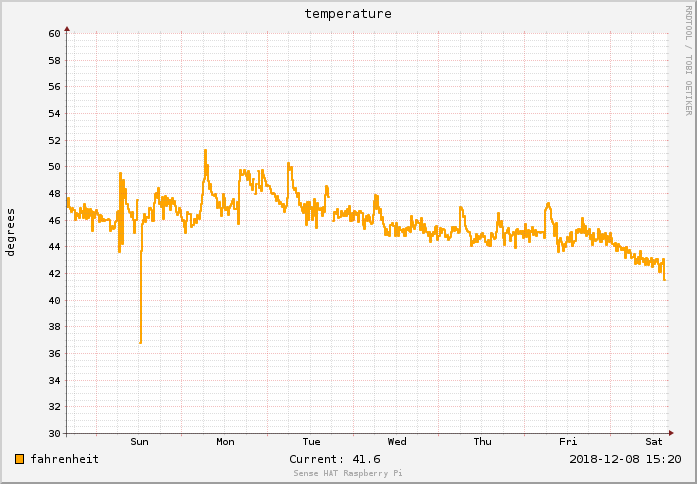
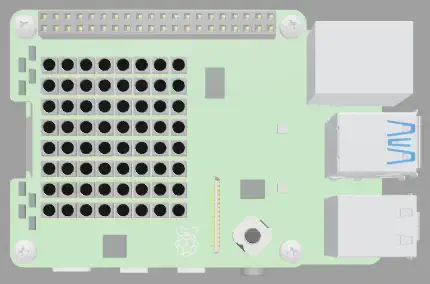

# The Sense HAT Raspberry Pi REST API

This project exposes a REST API on a [Raspberry Pi](https://www.raspberrypi.com/) equiped with a [Sense HAT](https://www.raspberrypi.org/products/sense-hat/).

The following commands are run on your Raspberry Pi:

## Install from release
```sh
curl -sSL https://github.com/jithware/sense-hat-rest/releases/latest/download/sense-hat-rest.run -o sense-hat-rest.run 
chmod +x sense-hat-rest.run
./sense-hat-rest.run 
```

## Install from git

```sh
git clone https://github.com/jithware/sense-hat-rest.git
cd sense-hat-rest
./setup.sh
```

## Usage

### API documentation
For the full Sense Hat REST API documentation, navigate to the defined [port](https://github.com/search?q=repo%3Ajithware%2Fsense-hat-rest+ExecStart&type=code) and root directory on your Raspberry Pi: `http://raspberrypi:8080/` 

The following are example calls to the temperature API. Humidity, pressure, compass, cpu temperature and others, are also available.

### Live temperature json
To retrieve live temperature json, GET temperature from the live directory: `http://raspberrypi:8080/live/temperature`

```sh
curl -s http://raspberrypi:8080/live/temperature
{"temperature": 16.162643432617188}
```

### Past temperature json
To retrieve past temperature json, GET temperature from the past directory: `http://raspberrypi:8080/past/temperature`

```sh
curl -s http://raspberrypi:8080/past/temperature?start=10m
{"meta": {"start": 1684696560, "end": 1684697220, "step": 60, "rows": 11, "columns": 1, "legend": ["temperature"]}, "data": [[15.988164344996578], [15.923168208224487], [15.866838042416385], [15.864454833753204], [15.97578711801058], [15.895773634887693], [15.894235919783785], [15.910474543874104], [15.89725421391983], [15.908842296578978], [null]]}
```

### Past temperature images
To view past temperature images, navigate to the html directory: `http://raspberrypi:8080/html/temperature_f`



### Live temperature on LED
To view live temperature on the LED, GET temperature from the display directory: `http://raspberrypi:8080/display/temperature_c`

```sh
curl -s http://raspberrypi:8080/display/temperature_c
13.3C
```


_The above image was emulated with [trinket](https://trinket.io/python/47c7c9a5f6?outputOnly=true&runOption=run)_

### IFTTT event

To trigger an IFTTT temperature event, create a webhook applet at [ifttt.com](https://ifttt.com/create/if-maker_webhooks) with a sense_hat event and update [sense-hat-rest.conf](./sense-hat-rest.conf) with your key and sensor values: 
```
[notify]

IFTTTKEY=
MINTEMP=
MAXTEMP=
```

## Debug

To debug issues, run [sense-hat-rest.py](./sense-hat-rest.py) from the command line with a different port and [sense-hat-rest.conf](./sense-hat-rest.conf) file:
```sh
./sense-hat-rest.py 8081 ./sense-hat-rest.conf
```
You can also debug in [Visual Studio Code](https://code.visualstudio.com/download) using the [launch.json](./.vscode/launch.json)

## Versioning

sense-hat-rest [releases](https://github.com/jithware/sense-hat-rest/releases) use the following [software versioning](https://en.wikipedia.org/wiki/Software_versioning):

_major.minor.maintenance_ (example: 1.2.3)

Examples updates:

* major = application rewrite
* minor = API or configuration addition or change
* maintenance = enhancements and bug fixes
